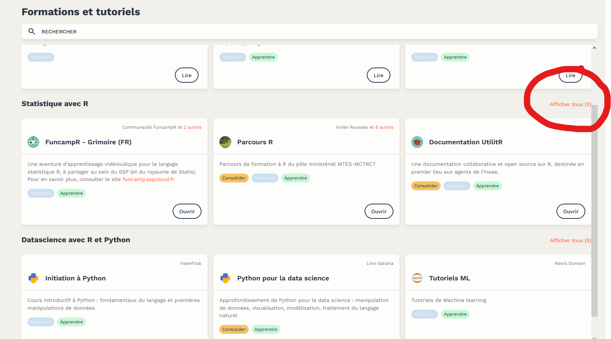
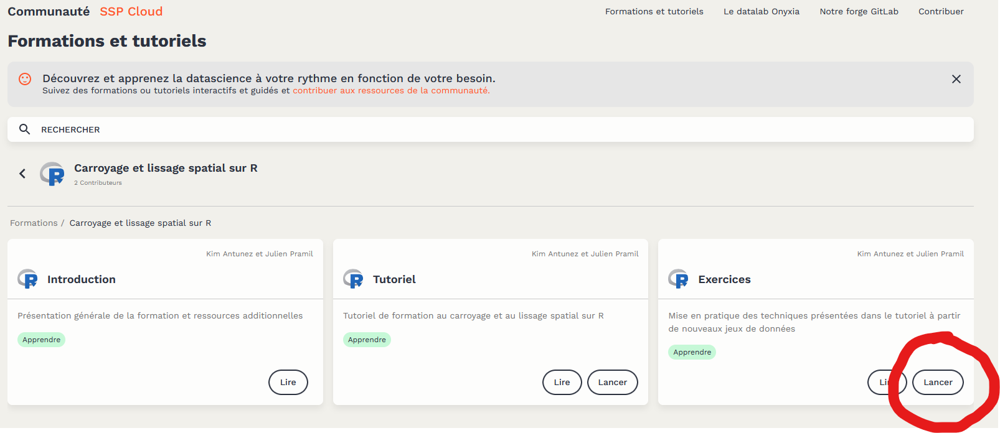
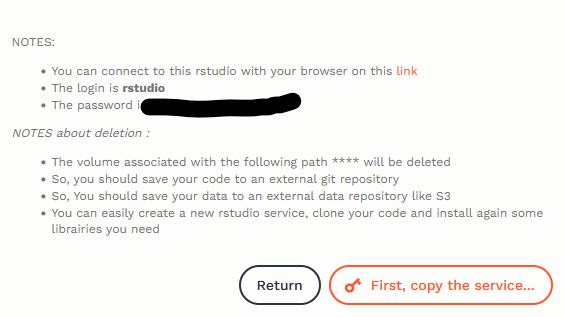
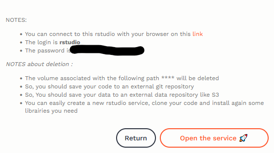
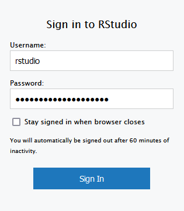

```{r setup, include=FALSE}

# path_proj <- "V:/PSAR-AU/Formation Comment utiliser les outils AU/2022/Séquence 6 - Outils [JP et KA]/tplissage_poc"
# path_lib <- paste0(path_proj,"/packages")

knitr::opts_chunk$set(echo = TRUE)
# knitr::opts_knit$set(root.dir = path_proj)

```

En 2018, le PSAR analyse urbaine, ancêtre de la section analyse urbaine à la direction générale de l'Insee, a développé un package R, nommé `btb` (auteurs : Arlindo Dos Santo et François Sémécurbe).

Sa principale fonction, `kernelSmoothing`, permet de réaliser très facilement un **carroyage** et un **lissage** sur des données géolocalisées avec R. 

À partir de données ponctuelles, nous allons apprendre en utilisant le langage R :

 - À carroyer les informations.
 - À réaliser des lissages de densité, des lissages de moyennes, des lissages de taux et des lissages quantiles.
 - À calculer un indicateur sur une zone à façon à partir des données carroyées de l'Insee.

**Liens utiles**

- Code de la formation : https://github.com/InseeFrLab/formation-r-lissage-spatial

- Site web des supports de formation : https://inseefrlab.github.io/formation-r-lissage-spatial
  * [Tutoriel](tuto.html)
  * [Exercices](exo.html)
  
**Pour réaliser l'exercice depuis la plateforme SSPCloud** :

  * Aller sur le SSPCloud : https://datalab.sspcloud.fr/  ;
  * Se connecter avec son adresse mail insee et son mot de passe ;
  * Cliquer sur **Trainings** en haut à droite de la page d'accueil ;
  * Dérouler l'ensemble des formations **Statistiques avec R** (comme ci-dessous)
  * Cliquer sur **Ouvrir** dans la bulle **Carroyage et lissage spatial sur R**


  
Les différentes parties de la présentation sont accessibles via le bouton **Lire**.
Pour réaliser l'exercice, vous pouvez ouvrir l'environnement RStudio préconfiguré en cliquant sur **Lancer**.



  * Attendre le chargement
  * Cliquer sur «\ **First, copy the service**\ »
  


  * Cliquer sur «\ **Copy the password**\ »
  

  
  * Authentifiez-vous avec :
      * l'identifiant : « **rstudio** »
      * le mdp copié précédemment à l'aide d'un CTRL+V


      
Et voilà, votre session RStudio préconfigurée est prête !
  
  
  